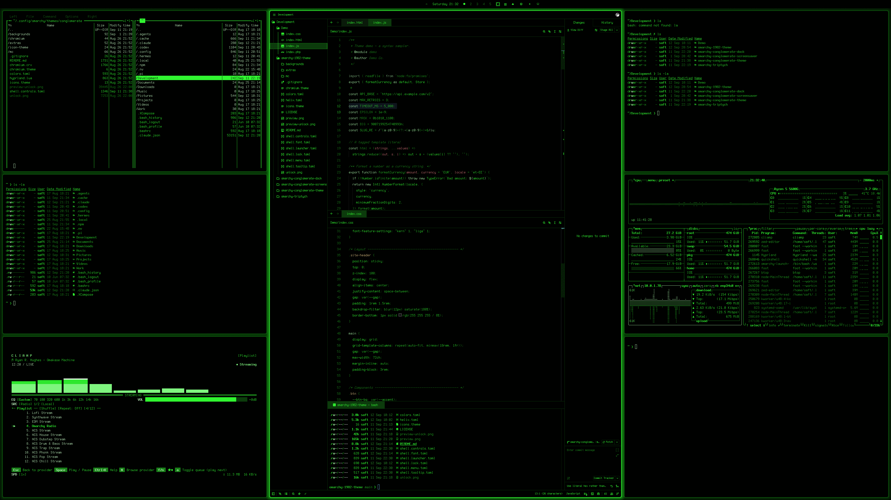

# 1982

A green-phosphor [Omarchy](https://omarchy.org/) theme — the IBM 5151
monochrome display: green on black, and nothing else.



Everything is MDA green except the code buffer in Neovim and Helix, which uses
the CGA 16-color palette so syntax highlighting still carries information.

## Install

```bash
omarchy theme install https://github.com/taavisaft/omarchy-1982-theme.git
```

## Font

The theme is drawn for **Terminess Nerd Font Mono** at 16px. An unpatched retro
font turns the bar's icons into tofu boxes, so it has to be a Nerd Font.

```bash
sudo pacman -S ttf-terminus-nerd
omarchy font set "Terminess Nerd Font Mono"
```

The font family is system-wide and cannot ship in a theme; only the size does,
in `shell.font.toml`.

**foot** — ask for pixels, not points, or the terminal won't line up with the
bar:

```ini
font=Terminess Nerd Font Mono:pixelsize=16
```

foot reads its config only at startup, so reopen its windows after a change.
`omarchy restart terminal` covers alacritty, kitty and ghostty — not foot.

**GTK apps** take the font from neither the theme nor `omarchy font set`:

```bash
gsettings set org.gnome.desktop.interface monospace-font-name "Terminess Nerd Font Mono 16px"
```

## Editors

**Helix** — nothing to do, `helix.toml` ships with the theme.

**Neovim** (LazyVim) — Omarchy strips `.lua` from a repo-installed theme, so
the colorscheme is a manual copy:

```bash
cp extras/neovim/colors/cga1982.lua   ~/.config/nvim/colors/
cp extras/neovim/lua/plugins/1982.lua ~/.config/nvim/lua/plugins/
```

Skip it and Neovim just follows the desktop and goes green.

**Zed** — green all the way down, buffer included:

```bash
cp extras/zed/settings.json ~/.config/zed/settings.json   # merge if you have your own
```

**Midnight Commander** — not themed by Omarchy, install and select the skin:

```bash
install -Dm644 mc/1982.ini ~/.local/share/mc/skins/1982.ini
sed -i 's/^skin=.*/skin=1982/' ~/.config/mc/ini   # or Options > Appearance
```

## Backgrounds

- `1-phosphor.png` — scanlines and a phosphor pool
- `2-post.png` — a power-on self-test

Both generated, 4K.

## Optional: window look

Gaps, rounding and the CRT glow aren't a theme's business, and Hyprland Lua is
dropped from a repo-installed theme. For the look in the screenshot, put this in
`~/.config/hypr/looknfeel.lua`:

```lua
hl.config({
  general = { border_size = 2, gaps_in = 4, gaps_out = 10 },
  decoration = {
    rounding = 6,
    rounding_power = 3,
    shadow = {
      enabled = true,
      range = 18,
      render_power = 3,
      color = "rgba(33ff3338)",
      color_inactive = "rgba(1a8f1a14)",
    },
  },
})
```

## License

[MIT](LICENSE)
